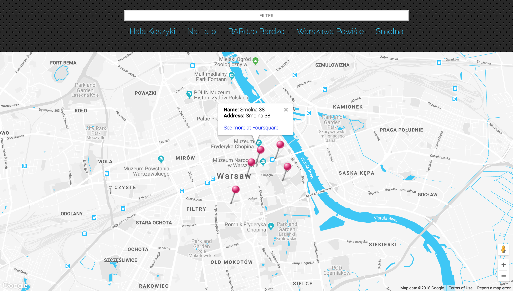

## ↘︎

This is a single page application featuring a map of my neighborhood. The map has the following functionalities: map markers to identify popular locations, a search function to easily discover these locations, and a list view to support simple browsing of all locations. You can also find the Foursquare API that provide additional information about each of these locations.

## How To Run The App

`🁤 create-react-app neighborhood-map-react`  
`🁥 cd neighborhood-map-react`  
`🁭 npm start`

## Features

1. Filter the locations showed on the map.
2. Click on any marker to check the place details.
3. Click on the location name in navigation bar to bounce the marker.

## Hint

The appetite grows with what it feeds on.

## Requirements

* [Node](https://nodejs.org/en/)
* [React](https://github.com/facebook/create-react-app)